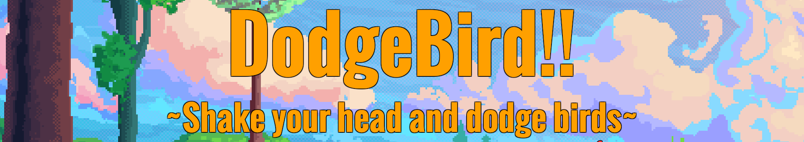
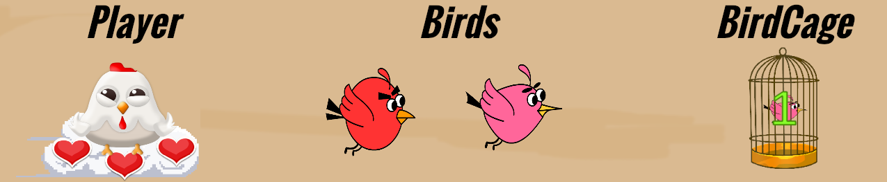
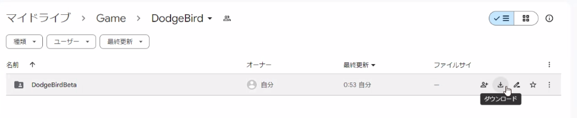
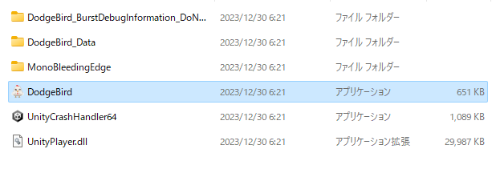

# DodgeBird
## ゲーム内容

"Webカメラに映る顔を動かしてプレイヤーを操作し、鳥をよけて身体を動かそう！"

- プレイヤー  
    Webカメラに映った顔で動かすことができます。ハートがなくなるとゲームオーバーです。
- 鳥  
    当たらないようにプレイヤーを操作してください。
- 鳥かご  
    カウントが0になると鳥が出てきます。プレイヤーを当てることで壊すことができます。

## 操作方法
Webカメラに顔を映して動かすことでプレイヤーを操作することができます。

## ダウンロード方法
### Google Drive
以下のリンクから"DodgeBirdBeta"のディレクトリをダウンロードしてください  
[DodgeBirdのダウンロード先](https://drive.google.com/drive/folders/1wqQLyg0r-y5tg3V81OV1bKk0fHV_i0zr?usp=sharing)

### GitHub
'git clone'でダウンロードできます  
__注意　このサイトからZipファイル形式で直接ダウンロードした場合は、正常に動きません__

## 実行方法
ダウンロードした"DodgeBirdBeta"の中の"DodgeBird.exe"をダブルクリックしてください

実行時に以下のポップが出てくる場合は、"詳細情報"→"実行"を押して下さい

## 備考

### OSについて
Windows 10, 11 での動作を確認済み。

### 実装について
- Unity を用いて個人制作
- C#, HLSL (コメント文を除き1800行)で実装
- 鳥やUIなどのデザイン・エフェクト・背景・BGM・効果音はUnity のフリーアセットを使用（以下の"使用アセットについて"を参照）
- 顔のモーショントラッキングはGoogle Mediapipeの"Blazeface"を使用

### 使用アセットについて

デザイン(鳥・鳥かご・プレイヤー・UI)
- [2D Cartoon Birds pack](https://assetstore.unity.com/packages/2d/characters/2d-cartoon-birds-pack-149167)
- [2D Cute Birds(4 in 1) Mini pack](https://assetstore.unity.com/packages/2d/characters/2d-cute-birds-4-in-1-mini-pack-237273)
- [2D Casual UI HD](https://assetstore.unity.com/packages/2d/gui/icons/2d-casual-ui-hd-82080)
- [2D Forest Tileset Pack Toon Style](https://assetstore.unity.com/packages/2d/environments/2d-forest-tileset-pack-toon-style-93499)
- [Cute Birds](https://assetstore.unity.com/packages/2d/characters/cute-birds-89649)
- [Fantasy Wooden GUI : Free](https://assetstore.unity.com/packages/2d/gui/fantasy-wooden-gui-free-103811)

エフェクト
- [Free Pixel Art FX Package](https://assetstore.unity.com/packages/2d/textures-materials/free-pixel-art-fx-package-185612)

背景
- [Animated Pixel-Art Backgrounds | Free](https://assetstore.unity.com/packages/2d/environments/animated-pixel-art-backgrounds-free-255208)

BGM
- [Free - Casual & Relaxing Game Music Pack](https://assetstore.unity.com/packages/audio/music/free-casual-relaxing-game-music-pack-262740)

効果音
- [FREE Casual Game SFX Pack](https://assetstore.unity.com/packages/audio/sound-fx/free-casual-game-sfx-pack-54116)
- [Jungle Animal Sound FX](https://assetstore.unity.com/packages/audio/sound-fx/animals/jungle-animal-sound-fx-13491)

### 参考資料
顔のモーショントラッキングのスクリプト作成で参考にしたサイト
- [BlazeFaceBarracuda](https://github.com/keijiro/BlazeFaceBarracuda)
- [Face detection guide](https://developers.google.com/mediapipe/solutions/vision/face_detector#get_started)